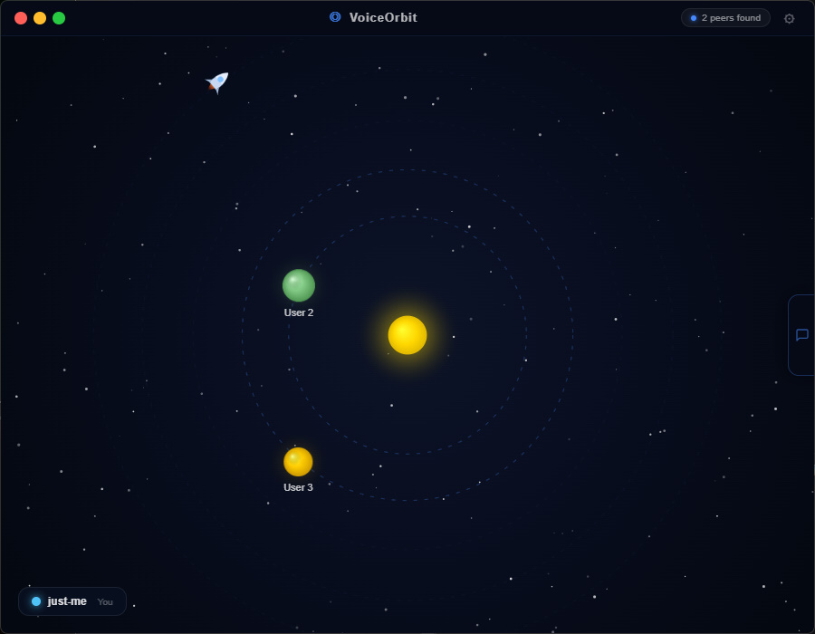
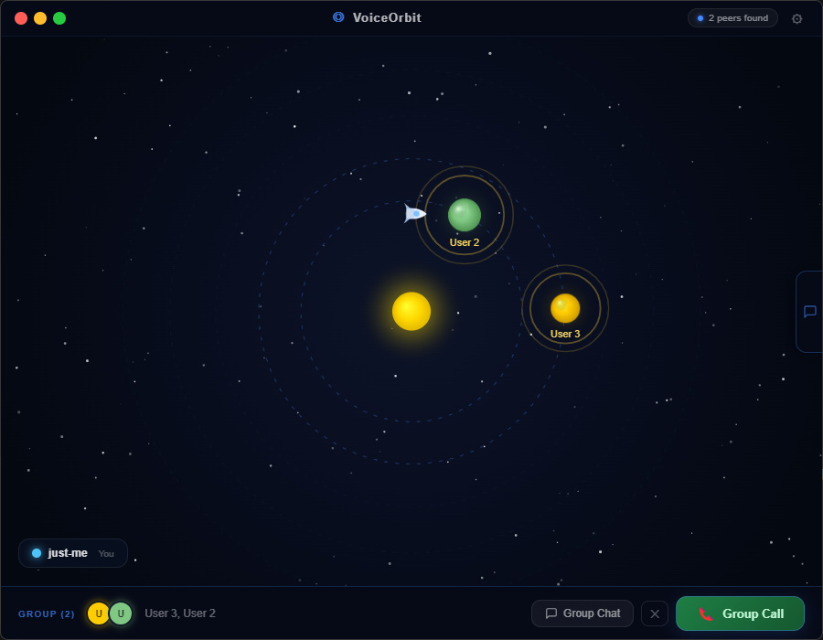
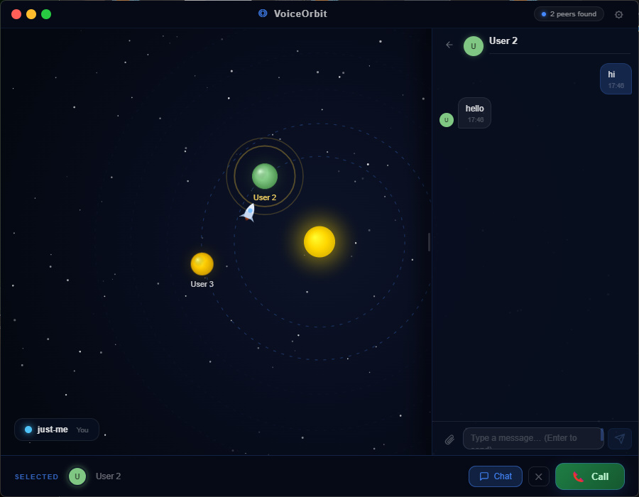
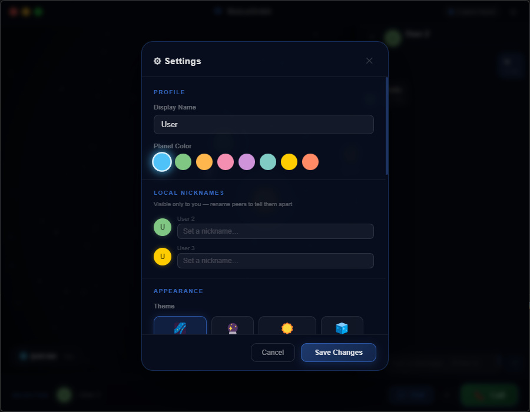
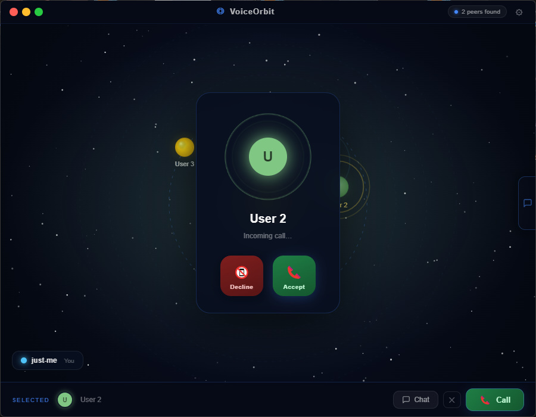
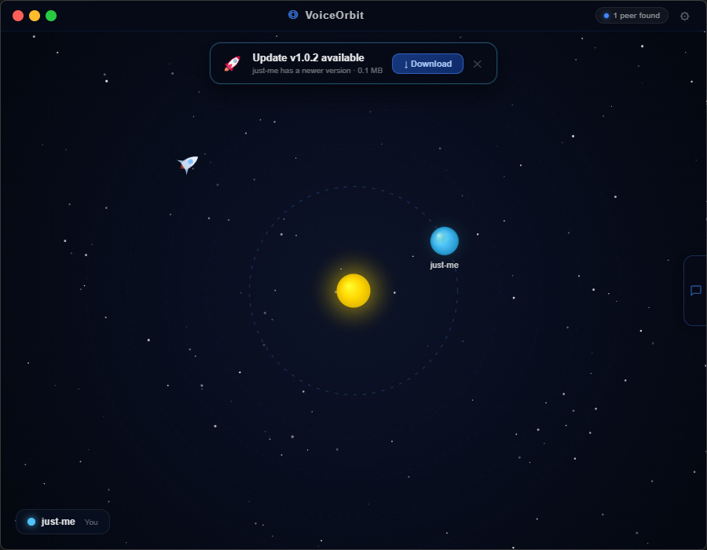

<div align="center">


# 🚀 VoiceOrbit

**Local-network voice chat with an orbital canvas UI**

[](https://www.electronjs.org/)
[](https://react.dev/)
[](https://www.typescriptlang.org/)
[](https://webrtc.org/)
[](https://www.microsoft.com/windows)
[](LICENSE)

[English](#english) · [Русский](README-RU.md)

</div>

---

<a name="english"></a>

## ✨ Overview

VoiceOrbit is a **zero-infrastructure LAN voice chat** built with Electron, React, and WebRTC.  
Instead of a boring contacts list, peers appear as **planets orbiting a central sun** — your rocket navigates the solar system, freely drifting when idle and flying toward selected planets to orbit them.

No servers. No accounts. No internet required.

---

## 📸 Screenshots

| Orbital Canvas | Group Call | Chat Panel |
|:-:|:-:|:-:|
|  |  |  |

| Settings & Themes | Incoming Call | Update Notification |
|:-:|:-:|:-:|
|  |  |  |

---

## 🎯 Features

### 🌌 Orbital UI
- Peers rendered as **animated planets** orbiting a central sun (you)
- Rocket **freely drifts** through space when idle; **flies toward and orbits** selected planets
- Planet surface textures generated deterministically from peer ID — everyone looks unique
- **Ripple effect** on canvas edges on incoming messages, themed to the current color scheme
- Speaking indicator — planet pulses when a peer is talking
- Connection lines drawn between call participants
- Star field with independent 10 fps twinkle, offscreen-cached background gradient

### 🎙️ Voice Calls
- **One-to-one and group calls** over WebRTC (pure P2P, no TURN server needed on LAN)
- Full participant-list sync — everyone sees who joined and who left, even in a mesh topology
- Mic mute toggle, per-peer volume slider
- Ringback tone while waiting for answer
- Incoming call notification with Accept / Decline

### 💬 Chat
- **Direct messages** and **group chats** (select multiple planets → *Group Chat*)
- Slide-out chat drawer on the right edge with an unread-chats badge
- Session list → conversation navigation (like any modern messenger)
- Sender names in the peer's orbit color in group chats
- File sharing with progress bar — images, videos, any file type
- Inline image preview; paste from clipboard with `Ctrl+V`
- Bubble pop-in animation for new messages
- Smart auto-scroll — pauses when you scroll up; scroll-to-bottom button appears

### 🔄 Auto-Update over LAN
- On startup, queries all peers for their version number
- Picks the **highest version** across the network as the update source
- Update package built **on demand** (`app.asar` only, ~2–5 MB instead of the full 150 MB runtime)
- Peer serves the zip over HTTP; client downloads without any file dialog
- `updater.bat` waits for the process to exit, swaps `app.asar`, relaunches automatically

### 🎨 Themes
8 built-in color themes — applied instantly via CSS variables, sky gradient and orbit colors included:

| # | Theme | Accent | Vibe |
|---|-------|--------|------|
| 🌌 | Deep Space | `#4488ff` | Classic dark navy |
| 🔮 | Nebula | `#cc44ff` | Deep violet |
| ☀️ | Solar Flare | `#ff8800` | Dark amber |
| 🧊 | Arctic | `#00ccff` | Dark teal |
| 🌿 | Forest | `#44cc66` | Deep green |
| 🔴 | Crimson | `#ff2244` | Near-black red |
| 🌙 | Midnight | `#9988ff` | Near-black indigo |
| ☢️ | Toxic | `#7fff00` | Acid lime on black |

### ⚙️ Settings
- UI scale slider (75 % – 140 %) — scales the entire interface
- Peer nicknames (local rename, not broadcast)
- Custom microphone / output device selection
- Windows Firewall auto-configuration on first run

---

## 🏗️ Tech Stack

| Layer | Technology |
|-------|-----------|
| Shell | **Electron 28** |
| UI | **React 18** + **TypeScript 5** + **Vite** |
| State | **Zustand** |
| Voice | **WebRTC** `RTCPeerConnection` |
| Discovery | UDP broadcast (LAN) |
| Signaling | TCP (custom, no WebSocket library) |
| File transfer | HTTP (`Worker` thread server) |
| Packaging | **electron-builder** |

---

## 🚀 Getting Started

### Prerequisites

- **Node.js 18+**
- **Windows 10 / 11** *(auto-update and firewall scripts are Windows-only)*

### Install & Run (dev)

```bash
git clone https://github.com/your-username/voice-orbit.git
cd voice-orbit
npm install
npm run dev
```

### Production Build

```bash
npm run build          # TypeScript + Vite compile
npx electron-builder   # package into installer / portable
```

### Build Multiple Versions for Update Testing

```bash
# defaults: 1.0.0, 1.0.1, 1.0.2
node scripts/build-test-versions.js

# custom versions
node scripts/build-test-versions.js 1.0.0 2.0.0 3.0.0
```

Output: `release/test/<version>/VoiceOrbit.exe`

---

## 📁 Project Structure

```
voice-orbit/
├── src/
│   ├── main/                     # Electron main process
│   │   ├── index.ts              # App entry & window setup
│   │   ├── discovery.ts          # UDP broadcast peer discovery
│   │   ├── signaling.ts          # TCP signaling server
│   │   ├── fileServer.ts         # HTTP file server (Worker thread)
│   │   ├── fileWorker.ts         # Worker — streams files, tracks progress
│   │   ├── ipc.ts                # All IPC handlers
│   │   ├── updatePackager.ts     # On-demand update zip builder (original-fs)
│   │   └── firewall.ts           # Windows Firewall rule helpers
│   │
│   ├── renderer/                 # React application
│   │   ├── components/
│   │   │   ├── OrbitCanvas/      # Canvas: planets, rocket, orbits, stars, effects
│   │   │   ├── Chat/             # ChatPanel, ChatDrawer, ChatSidebar
│   │   │   ├── CallOverlay/      # In-call participant panel & controls
│   │   │   ├── Settings/         # Settings modal
│   │   │   └── Update/           # LAN update notification banner
│   │   ├── hooks/
│   │   │   ├── useWebRTC.ts      # RTCPeerConnection management + group call sync
│   │   │   ├── useChat.ts        # Messaging, file transfer, session routing
│   │   │   ├── useAutoUpdate.ts  # Version discovery & update flow
│   │   │   ├── useSignaling.ts   # Signal routing dispatcher
│   │   │   ├── useDiscovery.ts   # Peer list management
│   │   │   └── useRingbackTone.ts# Ringback audio
│   │   ├── store/index.ts        # Zustand global state
│   │   ├── themes.ts             # 8 color themes + applyTheme()
│   │   └── App.tsx               # Root layout & call bar
│   │
│   └── shared/
│       └── types.ts              # Shared types & SignalingMessage union
│
├── scripts/
│   └── build-test-versions.js   # Multi-version build automation
│
└── BUILD-TEST-VERSIONS.bat       # One-click test build (double-click)
```

---

## 🤝 Contributing

Pull requests are welcome. For major changes, please open an issue first to discuss what you'd like to change.

1. Fork the repo
2. Create your branch: `git checkout -b feature/amazing-feature`
3. Commit your changes: `git commit -m 'feat: add amazing feature'`
4. Push: `git push origin feature/amazing-feature`
5. Open a Pull Request

---

## 📄 License

[MIT](LICENSE) © 2024

---

---

<a name="russian"></a>

<div align="center">

# 🚀 VoiceOrbit — Русский

**Голосовой чат для локальной сети с орбитальным интерфейсом**

</div>

## ✨ Описание

VoiceOrbit — **голосовой чат для LAN без серверов**, построенный на Electron, React и WebRTC.  
Вместо скучного списка контактов пиры отображаются как **планеты, вращающиеся вокруг центрального солнца**. Ваша ракета свободно дрейфует в пространстве и летит к выбранным планетам по орбите.

Никаких серверов. Никаких аккаунтов. Интернет не нужен.

---

## 🎯 Возможности

### 🌌 Орбитальный интерфейс
- Пиры — **анимированные планеты** на орбитах вокруг тебя (солнце)
- Ракета **свободно дрейфует** в простое и **летит к выбранной планете**, выходя на орбиту
- Текстуры планет генерируются из ID пира — каждый пользователь выглядит уникально
- **Эффект ряби** на краях экрана при входящих сообщениях (цвет совпадает с темой)
- Пульсация планеты когда пир говорит
- Линии связи между участниками звонка
- Звёздное поле с мерцанием; фоновый градиент тоже меняется под тему

### 🎙️ Голосовые звонки
- **Личные и групповые звонки** по WebRTC (P2P, TURN-сервер не нужен в LAN)
- Синхронизация списка участников — все видят кто вошёл и кто вышел
- Отключение микрофона, регулировка громкости для каждого пира
- Рингтон ожидания ответа

### 💬 Чат
- **Личные сообщения** и **групповые чаты** (выбери несколько планет → *Group Chat*)
- Выезжающая панель чатов справа с бейджем количества непрочитанных чатов
- Навигация: список сессий → переписка (как в обычном мессенджере)
- Имена отправителей цветом их планеты в групповых чатах
- Отправка файлов с прогресс-баром; предпросмотр изображений; вставка из буфера `Ctrl+V`
- Анимация пузырей новых сообщений
- Умный автоскролл — останавливается при прокрутке вверх; кнопка возврата вниз

### 🔄 Автообновление по LAN
- При старте опрашивает всех пиров на наличие новой версии
- Выбирает **наибольшую версию** в сети как источник обновления
- Пакет обновления строится **по запросу** (только `app.asar`, ~2–5 МБ вместо 150 МБ)
- Скачивание без диалога выбора папки; `updater.bat` ждёт закрытия, заменяет файлы, перезапускает

### 🎨 Темы
8 встроенных цветовых тем с мгновенным применением:
🌌 Deep Space · 🔮 Nebula · ☀️ Solar Flare · 🧊 Arctic · 🌿 Forest · 🔴 Crimson · 🌙 Midnight · ☢️ Toxic

---

## 🚀 Быстрый старт

```bash
git clone https://github.com/your-username/voice-orbit.git
cd voice-orbit
npm install
npm run dev
```

### Продакшен сборка

```bash
npm run build
npx electron-builder
```

### Несколько версий для тестирования обновлений

```bat
BUILD-TEST-VERSIONS.bat
```

Результат: `release\test\<version>\VoiceOrbit.exe`

---

## 📄 Лицензия

[MIT](LICENSE) © 2024

---

<div align="center">

Made with ☕ and TypeScript

**⭐ Поставь звезду если проект оказался полезным!**

</div>
